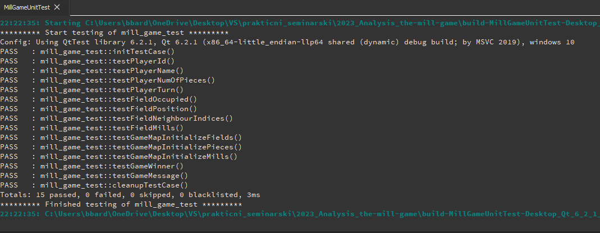

# Izveštaj analize projekta

## Valgrind - Memcheck
- Korišćenjem alata Memcheck programa Valgrind izvedena je analiza alociranja memorije
prilikom izvršavanja programa The Mill game.

Projekat je izgrađen korišćenjem komandi:

```  
cmake -G "Unix Makefiles" ../02-the-mill-game/ 
make
```

- Zatim je pokrenuta analiza memorije i izlaz preusmeren u fajl **valgrind_output.txt**
komandom:

```
 valgrind --leak-check=full --track-origins=yes --log-file=valgrind_output.txt ./NineMensMorris
```

- Sadržaj fajla:

```
==1313== Memcheck, a memory error detector
==1313== Copyright (C) 2002-2017, and GNU GPL'd, by Julian Seward et al.
==1313== Using Valgrind-3.15.0 and LibVEX; rerun with -h for copyright info
==1313== Command: ./NineMensMorris
==1313== Parent PID: 580
==1313== 
==1313== 
==1313== HEAP SUMMARY:
==1313==     in use at exit: 287,754 bytes in 5,574 blocks
==1313==   total heap usage: 659,844 allocs, 654,270 frees, 360,530,561 bytes allocated
==1313== 
==1313== 288 (256 direct, 32 indirect) bytes in 1 blocks are definitely lost in loss record 184 of 270
==1313==    at 0x483B7F3: malloc (in /usr/lib/x86_64-linux-gnu/valgrind/vgpreload_memcheck-amd64-linux.so)
==1313==    by 0x92DF2F4: ??? (in /usr/lib/x86_64-linux-gnu/libfontconfig.so.1.12.0)
==1313==    by 0x92DF9B8: ??? (in /usr/lib/x86_64-linux-gnu/libfontconfig.so.1.12.0)
==1313==    by 0x92E0FDC: ??? (in /usr/lib/x86_64-linux-gnu/libfontconfig.so.1.12.0)
==1313==    by 0x92E806C: ??? (in /usr/lib/x86_64-linux-gnu/libfontconfig.so.1.12.0)
==1313==    by 0x98D09D9: ??? (in /usr/lib/x86_64-linux-gnu/libexpat.so.1.6.11)
==1313==    by 0x98D16AF: ??? (in /usr/lib/x86_64-linux-gnu/libexpat.so.1.6.11)
==1313==    by 0x98CEB82: ??? (in /usr/lib/x86_64-linux-gnu/libexpat.so.1.6.11)
==1313==    by 0x98D004D: ??? (in /usr/lib/x86_64-linux-gnu/libexpat.so.1.6.11)
==1313==    by 0x98D3DBF: XML_ParseBuffer (in /usr/lib/x86_64-linux-gnu/libexpat.so.1.6.11)
==1313==    by 0x92E5F42: ??? (in /usr/lib/x86_64-linux-gnu/libfontconfig.so.1.12.0)
==1313==    by 0x92E637B: ??? (in /usr/lib/x86_64-linux-gnu/libfontconfig.so.1.12.0)
==1313== 
==1313== 352 bytes in 1 blocks are possibly lost in loss record 186 of 270
==1313==    at 0x483DD99: calloc (in /usr/lib/x86_64-linux-gnu/valgrind/vgpreload_memcheck-amd64-linux.so)
==1313==    by 0x40149CA: allocate_dtv (dl-tls.c:286)
==1313==    by 0x40149CA: _dl_allocate_tls (dl-tls.c:532)
==1313==    by 0x6136322: allocate_stack (allocatestack.c:622)
==1313==    by 0x6136322: pthread_create@@GLIBC_2.2.5 (pthread_create.c:660)
==1313==    by 0x5761463: QThread::start(QThread::Priority) (in /usr/lib/x86_64-linux-gnu/libQt5Core.so.5.12.8)
==1313==    by 0x931CD19: ??? (in /usr/lib/x86_64-linux-gnu/libQt5DBus.so.5.12.8)
==1313==    by 0x931E2BB: QDBusConnection::sessionBus() (in /usr/lib/x86_64-linux-gnu/libQt5DBus.so.5.12.8)
==1313==    by 0x91E30F4: ??? (in /usr/lib/x86_64-linux-gnu/libQt5XcbQpa.so.5.12.8)
==1313==    by 0x91E321C: ??? (in /usr/lib/x86_64-linux-gnu/libQt5XcbQpa.so.5.12.8)
==1313==    by 0x4B5A55F: ??? (in /usr/lib/x86_64-linux-gnu/libQt5Widgets.so.5.12.8)
==1313==    by 0x12FEF9: Ui_MainMenu::setupUi(QMainWindow*) (in /mnt/c/Users/bbard/OneDrive/Desktop/VS/prakticni_seminarski/build/NineMensMorris)
==1313==    by 0x12F4C5: MainMenu::MainMenu() (in /mnt/c/Users/bbard/OneDrive/Desktop/VS/prakticni_seminarski/build/NineMensMorris)
==1313==    by 0x127F72: main (in /mnt/c/Users/bbard/OneDrive/Desktop/VS/prakticni_seminarski/build/NineMensMorris)
==1313== 
==1313== LEAK SUMMARY:
==1313==    definitely lost: 256 bytes in 1 blocks
==1313==    indirectly lost: 32 bytes in 1 blocks
==1313==      possibly lost: 352 bytes in 1 blocks
==1313==    still reachable: 287,114 bytes in 5,571 blocks
==1313==         suppressed: 0 bytes in 0 blocks
==1313== Reachable blocks (those to which a pointer was found) are not shown.
==1313== To see them, rerun with: --leak-check=full --show-leak-kinds=all
==1313== 
==1313== For lists of detected and suppressed errors, rerun with: -s
==1313== ERROR SUMMARY: 2 errors from 2 contexts (suppressed: 0 from 0)
```

- Kao što vidimo imamo definitivni gubitak 256 bajta, ali kada pogledamo gde se ta greška desila vidimo da su to bibliotečke funkcije koje valgrind ne može da isprati. Zbog toga nije moguće locirati ovu grešku.

- Takođe vidimo da imamo mogući gubitak 352 bajta. Kada ispitamo stek poziva vidimo da je mogući gubitak izazvao poziv funkcije __calloc__ čiji je krajnji pozivaoc konstruktor klase __MainMenu__ u __main__ funkciji projekta. Međutim, konstruktor klase __MainMenu__
je funkcija biblioteke koje korisit razvojno okruženje __qt__. Time zaključujemo da ne postoji gubitak memorije koji je izazvan od strane programera. 

## Valgrind - Massif
- korišćenjem alata massif na projektu The Mill Game izvedena je analiza preseka stanja hipa programa tokom njegovog izvršavanja.

- program je pokrenut u massifu korišćenjem komande:
```
$ valgrind --tool=massif ./NineMensMorris
```
- zatim je izlaz koji je dobijen iz massif-a korišćenjem programa ms_print prusmeren
u datoteku __massif_graph.txt__ komandom:

```
 $ ms_print massif.out.283 > massif_graph.txt
```
- Graf dobijen iz analize massif-a:
```
--------------------------------------------------------------------------------
Command:            ./NineMensMorris
Massif arguments:   (none)
ms_print arguments: massif.out.283
--------------------------------------------------------------------------------


    MB
11.92^       #                                                                
     |       #                  ::                    ::                    ::
     |       #                  ::                    ::                    ::
     |       #:                 :::                   ::                    ::
     |   ::::#:::::::@::::::::::::::::::@:::@:::@:::@:::::::::@::::@::::@:::::
     |   : ::#::::: :@::::::: :::::: :: @:::@:::@:::@:::::::::@::::@::::@:::::
     | ::: ::#::::: :@::::::: :::::: :: @:::@:::@:::@:::::::::@::::@::::@:::::
     | ::: ::#::::: :@::::::: :::::: :: @:::@:::@:::@:::::::::@::::@::::@:::::
     | ::: ::#::::: :@::::::: :::::: :: @:::@:::@:::@:::::::::@::::@::::@:::::
     | ::: ::#::::: :@::::::: :::::: :: @:::@:::@:::@:::::::::@::::@::::@:::::
     | ::: ::#::::: :@::::::: :::::: :: @:::@:::@:::@:::::::::@::::@::::@:::::
     | ::: ::#::::: :@::::::: :::::: :: @:::@:::@:::@:::::::::@::::@::::@:::::
     | ::: ::#::::: :@::::::: :::::: :: @:::@:::@:::@:::::::::@::::@::::@:::::
     | ::: ::#::::: :@::::::: :::::: :: @:::@:::@:::@:::::::::@::::@::::@:::::
     | ::: ::#::::: :@::::::: :::::: :: @:::@:::@:::@:::::::::@::::@::::@::::@
     | ::: ::#::::: :@::::::: :::::: :: @:::@:::@:::@:::::::::@::::@::::@::::@
     | ::: ::#::::: :@::::::: :::::: :: @:::@:::@:::@:::::::::@::::@::::@::::@
     | ::: ::#::::: :@::::::: :::::: :: @:::@:::@:::@:::::::::@::::@::::@::::@
     | ::: ::#::::: :@::::::: :::::: :: @:::@:::@:::@:::::::::@::::@::::@::::@
     | ::: ::#::::: :@::::::: :::::: :: @:::@:::@:::@:::::::::@::::@::::@::::@
   0 +----------------------------------------------------------------------->Gi
     0                                                                   14.81

Number of snapshots: 87
 Detailed snapshots: [6 (peak), 14, 31, 35, 39, 43, 56, 66, 76, 86]

--------------------------------------------------------------------------------
  n        time(i)         total(B)   useful-heap(B) extra-heap(B)    stacks(B)
--------------------------------------------------------------------------------
  0              0                0                0             0            0
  1    299,092,330        8,804,768        8,594,617       210,151            0
  2    619,915,906        8,835,824        8,624,766       211,058            0
  3    836,163,603       10,574,104        8,332,089     2,242,015            0
  4  1,176,574,448       10,574,104        8,332,089     2,242,015            0
  5  1,381,321,966       10,574,104        8,332,089     2,242,015            0
  6  1,618,951,593       12,501,448       10,258,730     2,242,718            0
```

- Kao što vidimo massif je napravio 87 preseka hipa memorije i nama izdvojio samo neke od njih. Na grafu vidimo da je vrhunac u preseku 6 kada je potrošnja hipa oko 11.92 MB.
Međutim i ostali preseci su slični po potrošnji i vidimo da nema nekih naglih skokova u korišćenju hip memorije.

- Ponovo smo testirali program ali sada sa dodatnom opcijom koja prati zauzeće steka.
- Program je pokrenut sa komandom:
```
$ valgrind --tool=massif --stacks=yes ./NineMensMorris
```
- I graf dobijen analizom je ispisan u odgovarajući *.txt* fajl komandom:
```
$ ms_print massif.out.435 > massif_graph_2.txt
``` 
- Dobijen graf iz izlaznog fajla massif_graph_2.txt:
```
--------------------------------------------------------------------------------
Command:            ./NineMensMorris
Massif arguments:   --stacks=yes
ms_print arguments: massif.out.435
--------------------------------------------------------------------------------


    MB
11.88^                                       :                                
     |      #: :  @  :::  :::  :::  :  :   ::::::::::::::::::::::@::::::@:::::
     |      #: :  @  : :  : :  : :  :  :   :::: :: :::::: :::::::@::::::@:::::
     |      #:::::@::: :::: :::: ::::@@:::::::: :: :::::: :::::::@::::::@:::::
     | :: ::#:::: @: : :: : :: : :: :@ : :::::: :: :::::: :::::::@::::::@:::::
     | :  : #:::: @: : :: : :: : :: :@ : :::::: :: :::::: :::::::@::::::@:::::
     | : :: #:::: @: : :: : :: : :: :@ : :::::: :: :::::: :::::::@::::::@:::::
     | : :: #:::: @: : :: : :: : :: :@ : :::::: :: :::::: :::::::@::::::@:::::
     | : :: #:::: @: : :: : :: : :: :@ : :::::: :: :::::: :::::::@::::::@:::::
     | : :: #:::: @: : :: : :: : :: :@ : :::::: :: :::::: :::::::@::::::@:::::
     | : :: #:::: @: : :: : :: : :: :@ : :::::: :: :::::: :::::::@::::::@:::::
     | : :: #:::: @: : :: : :: : :: :@ : :::::: :: :::::: :::::::@::::::@:::::
     | : :: #:::: @: : :: : :: : :: :@ : :::::: :: :::::: :::::::@::::::@:::::
     | : :: #:::: @: : :: : :: : :: :@ : :::::: :: :::::: :::::::@::::::@:::::
     | : :: #:::: @: : :: : :: : :: :@ : :::::: :: :::::: :::::::@::::::@:::::
     | : :: #:::: @: : :: : :: : :: :@ : :::::: :: :::::: :::::::@::::::@:::::
     | : :: #:::: @: : :: : :: : :: :@ : :::::: :: :::::: :::::::@::::::@:::::
     | : :: #:::: @: : :: : :: : :: :@ : :::::: :: :::::: :::::::@::::::@:::::
     | : :: #:::: @: : :: : :: : :: :@ : :::::: :: :::::: :::::::@::::::@:::::
     | : :: #:::: @: : :: : :: : :: :@ : :::::: :: :::::: :::::::@::::::@:::::
   0 +----------------------------------------------------------------------->Gi
     0                                                                   7.194

Number of snapshots: 62
 Detailed snapshots: [4 (peak), 9, 22, 47, 55]

--------------------------------------------------------------------------------
  n        time(i)         total(B)   useful-heap(B) extra-heap(B)    stacks(B)
--------------------------------------------------------------------------------
  0              0                0                0             0            0
  1    158,158,623       10,074,544        9,868,277       194,099       12,168
  2    356,616,563        8,785,312        8,577,734       195,306       12,272
  3    535,759,662       10,113,080        9,903,837       196,227       13,016
  4    679,344,638       12,430,648       12,221,208       196,192       13,248
```
- Vidimo da je korišćenje hip memorije slično kao i u prethodnom primeru, bez nekih naglih skokova u zauzeću memorije.
- Takođe sada imamo ispunjenu statistiku o korišćenju stek memorije. Vidimo da se kreće oko dvanaest hiljada za većinu izvršavanja osim što u preseku 9 postoji nagli skok extra-heap i stacks vrednosti.
```
--------------------------------------------------------------------------------
  n        time(i)         total(B)   useful-heap(B) extra-heap(B)    stacks(B)
--------------------------------------------------------------------------------
  5    827,401,122       12,206,600       11,997,560       196,280       12,760
  6    919,875,185       10,910,256       10,699,561       196,271       14,424
  7  1,055,126,774       12,206,320       11,997,624       196,248       12,448
  8  1,178,987,838       10,905,272       10,696,108       196,212       12,952
  9  1,362,233,868       12,160,424       10,357,563     1,768,717       34,144
```
- Ali se ona dosta brzo vraća na prosečnu u narednim.
```
--------------------------------------------------------------------------------
  n        time(i)         total(B)   useful-heap(B) extra-heap(B)    stacks(B)
--------------------------------------------------------------------------------
 10  1,461,501,840       10,905,720        9,123,561     1,769,207       12,952
 11  1,633,562,554       12,209,696       10,164,572     2,032,108       13,016
 12  1,831,449,452       12,192,168       10,148,208     2,032,480       11,480
 13  2,010,558,760       10,895,760        8,850,209     2,032,407       13,144
 14  2,208,876,200       12,190,496       11,979,818       197,926       12,752
 15  2,369,399,978       12,190,736       10,144,686     2,032,986       13,064
 16  2,562,187,078       10,888,160        8,842,311     2,032,897       12,952
 17  2,688,349,477       12,190,400       10,144,566     2,033,026       12,808
 18  2,782,971,062       12,190,040       10,144,566     2,033,026       12,448
 19  2,909,130,794       12,190,104       10,144,202     2,033,014       12,888
 20  3,100,369,648       10,889,816        8,843,787     2,033,077       12,952
 21  3,226,531,158       12,191,128       10,145,142     2,033,058       12,928
 22  3,352,691,084       10,894,200        8,846,882     2,032,942       14,376
```
- Zaključujemo da se hip memorija uglavnom odgovorno koristi.

## Testiranje jedinica koda - QtTest

- Korisćeno je radno okruženje *Qt Creator 5.0.3* da bismo napravili poseban projekat za testiranje projekta *The Mill Game*.

- Tokom testiranja testirane su četiri klase projekta *The Mill Game*, to su:
	- **Player**
	- **Field**
	- **GameMap**
	- **Game**

- Testovi koji su napisani su:

	- void **testPlayerId()**
      - testira funkcije vezane za člansku promenljivu *id* klase *Player*.
  - void **testPlayerName()** 
      - testira funkcije vezane za člansku promenljivu *name* klase *Player*.
  - void **testPlayerNumOfPieces()**
      - testira funkcije koje regulišu broj figura koje igrač ima.
  - void **testPlayerTurn()**
      - testira funkcije koje upravljaju time čiji je red da igra.

  &nbsp;

  - void **testFieldOccupied()**
      - testira funkcije koje upravljaju time da li je polje na tabli zauzeto ili ne.

  - void **testFieldPosition()**
      - tesitra funkcije vezane za člansku promenljivu *position* klase *Field*

  - void **testFieldNeighbourIndices()**
      - testira funkcije koje dodaju i dohvataju listu susednih polja nekog polja.
  - void **testFieldMills()**
      - testira funkcije koje postavljaju odgovarajuće vertikalne i horizontalne parove nekog polja.

  &nbsp;

  - void **testGameMapInitializeFields()**
      - testira da li mapa pravilno inicijalizuje sva polja i da sva polja imaju odgovarajući broj suseda.
  - void **testGameMapInitializePieces()**
      - testira da li mapa pravilno inicijalizuje broj figra za oba igrača i da li ih je jednako.
  - void **testGameMapInitializeMills()**
      - testira da li mapa inicijalizuje kombinacije za svako polje.

  &nbsp;

  - void **testGameWinner()**
      - testira funkcije za postavljanje pobednika.

  - void **testGameMessage()**
      - testira funkcije za postavljanje poruka za igru i poruka za grešku programa.

&nbsp;

- Kada pokrenemo projekat možemo da vidimo da se svi testovi završavaju uspešno.



- Zaključak: Sve testirane funkcije rade u skladu sa njihovim očekivanim ponašanjem.

## Clang statička analiza (scan-build)

- Korišćen je clang statički analizator za pronalaženje grešaka u projektu the mill game.
Za analizu je koriščen alata clanga koji se zove *scan-build*. Cilj je bio da statičkom analizom pronađemo neki propust u kodu koji ovaj alat može da pronađe.

- pri poretanju *CMake* programa korišćena je komanda: 
```
scan-build --use-c++=g++ cmake ../02-the-mill-game/ -Bbuild
```
- dok je pri kompajliranju korišćena komanda:
```
scan-build --use-c++=g++ make -C build
```
- kodu je trebalo značajno duže vremena da se izgradi nego inače (pet minuta, umesto za oko desetak sekundi).


- Na kraju smo dobili obaveštenje da je gotova analiza i gde se nalazi izveštaj.


- Na kraju pokrećemo preporučenu komandu:
```
    scan-view /tmp/scan-build-2023-01-29-001204-1720-1
```

- i dobijamo izveštaj:


- Kao što vidimo, postoji samo jedan bag u izveštaju. Imamo mrtvu inicijalizaciju u fajlu *GameAi.cpp* na liniji 286. To je kada se inicijalizuje neka promenljiva koja se posle nikada ne koristi u okviru u kom je definisana.

- Ako odemo u kodu na tu liniju vidimo da na toj liniji postoji promenljiva *player* koja se inicijalizuje na vrednost *playerAI* i koja se više ne referiše u toj funkciji, što potvrđuje konstataciju statičkog analizatora.


- **Zaključak**: statička analiza koda nije otkrila puno nedostataka u samom kodu osim jedne loše inicijalizacije.

